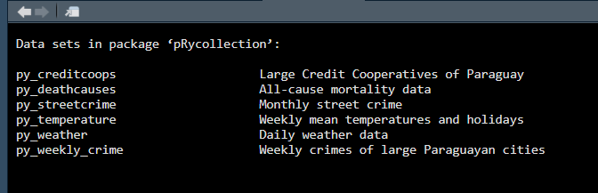

<!-- README.md is generated from README.Rmd. Please edit that file -->

```{r setup, include = FALSE}
knitr::opts_chunk$set(
  collapse = TRUE,
  comment = "#>",
  fig.path = "man/figures/README-",
  out.width = "75%",
  warning = FALSE,
  message = FALSE,
  fig.retina = 2,
  fig.align = 'center'
)
library(tidyverse)
library(pRycollection)
library(frictionless)
```

# pRycollection

<!-- badges: start -->
[](https://github.com/schneiderpy/pRycollection/actions/workflows/R-CMD-check.yml)
[](https://www.repostatus.org/#wip)
[](https://doi.org/10.5281/zenodo.16744968)

<!-- badges: end -->


> Note that this package is a *work in progress*! New data will be added
as soon as they become available.


[Si desea leer estas instrucciones en español haga clic en este enlace.](../pRycollection/README.md)

**Datasets with enriched metadata**

The main goal of **pRycollection** is to provide datasets about Paraguay for
research and teaching that are not easily found or accessible. 
pRycollection is a combination of the 3-letter code for Paraguay - PRY - 
and the word collection. The 3-letter code was chosen to avoid possible
confusion with the programming language Python (py).


## Installation

You can install the development version of pRycollection from [GitHub](https://github.com/schneiderpy) with:

```r
# install.packages("pak")
pak::pak("schneiderpy/pRycollection")

# load pRycollection
library(pRycollection)
```

## About the data

The pRycollection data package was build from the beginning with FAIR
principles in mind. **FAIR** stands for **F**indable, **A**ccessible,
**I**nteroperable, and **R**eusable. These principles are critical to
maximizing the impact and value of data in research and practice.

The raw data is hosted on [Zenodo](https://doi.org/10.5281/zenodo.16729963)

To see what datasets are included in the package load the pRycollection
data package and the `dataset` package (to access meta data). Then type
the following code line:

```{r, warning=FALSE}
data(package = "pRycollection")
```

This will open a new tab in your source pane listing all available
datasets.



## Examples

This is a basic example which shows you how to use pRycollection.
Let's use the `py_temperature` dataset.

A summary of the chosen dataset.

```{r}
summary(py_temperature)
```

The first six rows of the dataset ...

```{r example}
head(py_temperature)
```

... the dimensions of the dataset ...

```{r py_temperature}
dim(py_temperature)
```


## Citation

To cite the pRycollection package or datasets, please use:

```{r}
citation("pRycollection")
```


