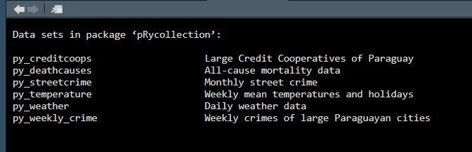

<!-- README.md is generated from README.Rmd. Please edit that file -->

# pRycollection

<!-- badges: start -->

[](https://github.com/schneiderpy/pRycollection/actions/workflows/R-CMD-check.yml)
[](https://www.repostatus.org/#wip)
[](https://doi.org/10.5281/zenodo.16744968)

<!-- badges: end -->

> Tenga en cuenta que este paquete de software está en desarrollo. Se
> añadirán nuevos datos en cuanto estén disponibles.

**Conjuntos de datos con metadatos enriquecidos**

El objetivo principal de **pRycollection** es proporcionar conjuntos de
datos sobre Paraguay para la investigación y la docencia que no son
fáciles de encontrar o acceder. pRycollection es una combinación del
código de tres letras de Paraguay (PRY) y la palabra “colección”. El
código de tres letras se eligió para evitar posibles confusiones con el
lenguaje de programación Python (py).

## Instalación

Puede instalar la versión de desarrollo de pRycollection desde
[GitHub](https://github.com/schneiderpy) with:

``` r
# install.packages("pak")
pak::pak("schneiderpy/pRycollection")

# load pRycollection
library(pRycollection)
```

## Acerca de los datos

El paquete de datos pRycollection se creó desde el principio, al menos,
con los principios FAIR. **FAIR** significa **E**ncontrable,
**A**ccesible, **I**nteroperable y **R**eutilizable (con sus signos en
ingles). Estos principios son fundamentales para maximizar el impacto y
el valor de los datos en la investigación y la práctica.

Los datos originales están alojados en
[Zenodo](https://doi.org/10.5281/zenodo.16729963)

Para ver los conjuntos de datos incluidos en el paquete, cargue el
paquete de datos `pRycollection` y el paquete `dataset` (para acceder a
los metadatos). A continuación, escriba la siguiente línea de código:

``` r
# install.packages("dataset")
# library(dataset)

data(package = "pRycollection")
```

Esto abrirá una nueva pestaña en el panel de origen que enumera todos
los conjuntos de datos disponibles.

<figure>

<figcaption aria-hidden="true">Available datasets</figcaption>
</figure>

## Ejemplos

Este es un ejemplo básico que muestra cómo usar pRycollection. Usemos el
conjunto de datos `py_temperature`.

Un resumen del conjunto de datos elegido.

``` r
summary(py_temperature)
#> Schneider (2025): Summary of Weekly mean temperature data [dataset], https://doi.org/10.5281/zenodo.16729963
#> 
#> Country name
#> Country ISO code
#> Mean temperature (degrees Celsius)
#> Holiday indicator
#>     rowid             country              ISO                 city  
#>  Length:1565        Length:1565        Length:1565        Min.   :1  
#>  Class :character   Class :character   Class :character   1st Qu.:2  
#>  Mode  :character   Mode  :character   Mode  :character   Median :3  
#>                                                           Mean   :3  
#>                                                           3rd Qu.:4  
#>                                                           Max.   :5  
#>       week               avg_temp         holiday      
#>  Min.   :2016-01-04   Min.   : 9.329   Min.   :0.0000  
#>  1st Qu.:2017-07-03   1st Qu.:20.043   1st Qu.:0.0000  
#>  Median :2018-12-31   Median :24.214   Median :0.0000  
#>  Mean   :2018-12-31   Mean   :23.280   Mean   :0.1885  
#>  3rd Qu.:2020-06-29   3rd Qu.:26.529   3rd Qu.:0.0000  
#>  Max.   :2021-12-27   Max.   :32.000   Max.   :1.0000
```

Las primeras seis filas del conjunto de datos …

``` r
head(py_temperature)
#> Schneider (2025): Weekly mean temperature data [dataset], https://doi.org/10.5281/zenodo.16729963
#>   rowid     country   ISO       city         week       avg_temp  holiday   
#>   <defined> <defined> <defined> <defined>    <dttm_dfn> <defined> <defined>
#> 1 obs:1     Paraguay  PY        1 [Asuncion] 2016-01-04 27.8      0        
#> 2 obs:2     Paraguay  PY        1 [Asuncion] 2016-01-11 30.3      0        
#> 3 obs:3     Paraguay  PY        1 [Asuncion] 2016-01-18 29.9      0        
#> 4 obs:4     Paraguay  PY        1 [Asuncion] 2016-01-25 27.3      1        
#> 5 obs:5     Paraguay  PY        1 [Asuncion] 2016-02-01 26.6      0        
#> 6 obs:6     Paraguay  PY        1 [Asuncion] 2016-02-08 30.1      0
```

… las dimensiones del conjunto de datos …

``` r
dim(py_temperature)
#> [1] 1565    7
```

## Citación

Para citar el paquete o los conjuntos de datos pRycollection, utilice:

``` r
citation("pRycollection")
#> To cite pRycollection in publications please use:
#> 
#>   Schneider A (2025). _pRycollection: Diverse datasets from Paraguay_.
#>   R package version 0.0.1,
#>   <https://github.com/schneiderpy/pRycollection/>.
#> 
#> Please also cite the related data package:
#> 
#>   Schneider A (2025). "pRydata: Diverse datasets from Paraguay."
#>   doi:10.5281/zenodo.16729963
#>   <https://doi.org/10.5281/zenodo.16729963>.
#> 
#> To see these entries in BibTeX format, use 'print(<citation>,
#> bibtex=TRUE)', 'toBibtex(.)', or set
#> 'options(citation.bibtex.max=999)'.
```
