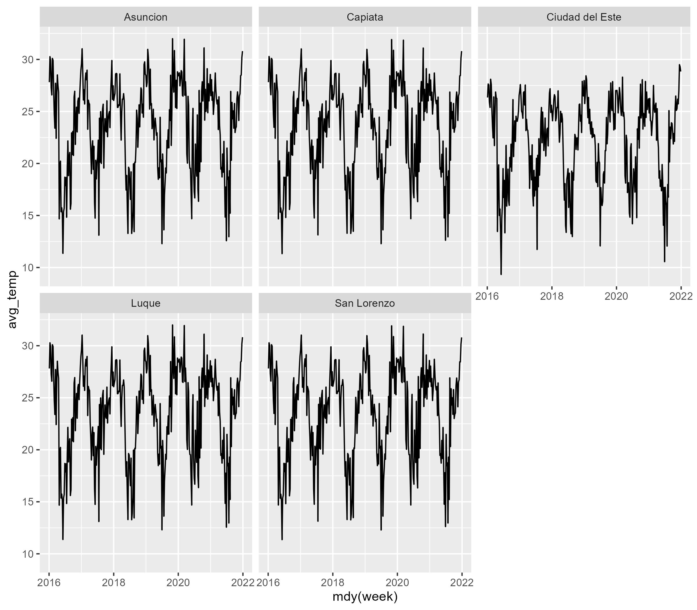

```{r setup, include = FALSE}
knitr::opts_chunk$set(
  collapse = TRUE,
  comment = "#>",
  fig.path = "man/figures/README-",
  out.width = "75%",
  warning = FALSE,
  message = FALSE,
  fig.retina = 2,
  fig.align = 'center'
)
library(pRycollection)
library(frictionless)
library(dataset)
library(ggplot2)
```

Here are some more examples of how you can use the pRycollection package
or any of its dataset.
We stay with the `py_temperature` dataset, which has `r ncol(py_temperature)`
variables and `r nrow(py_temperature)` weeks of temperature data for the
cities of `r unique(as_factor(py_temperature$city))`.
We could make, for example, a facet plot of the average weekly
temperature for each city in the dataset.

```r
plot
```

```{r plot, echo=FALSE, eval=FALSE}
plot <- py_temperature |> ggplot(aes(x = week, y = avg_temp)) +
  geom_line() +
  facet_wrap(~ as_factor(city))
ggsave("../vignettes/fig/temp-plot.png", width = 8)
```

```{r, echo=FALSE}

```

Now let's make a somewhat more complex example:
Let us say we want to analyze a specific crime type and add the `avg_temp`
column and the `holiday` column from the `py_temperature` dataset as
additional variables.

```{r}
library(pRycollection)
crime <- py_weekly_crime
temp <- py_temperature
domviol <- crime |> dplyr::select(city, category, week, crimes) |> 
  dplyr::filter(category == 1)

```

```{r}
domviol <- dplyr::bind_cols(domviol, temp[,c("avg_temp", "holiday")])
head(domviol)
```

We can check the length of the new data frame with the `dim()` function
and compare the result with the length of the `py_temperature` dataset
which should be the same, otherwise we would have been seen an
`error` message.

```{r}
dim(domviol)
```

If you type the following line of code ...

```{r, eval=FALSE}
View(domviol)
```

a new pane will pop up with the dataset. In this dataset you can also
see additional meta data which were not avaiable before.