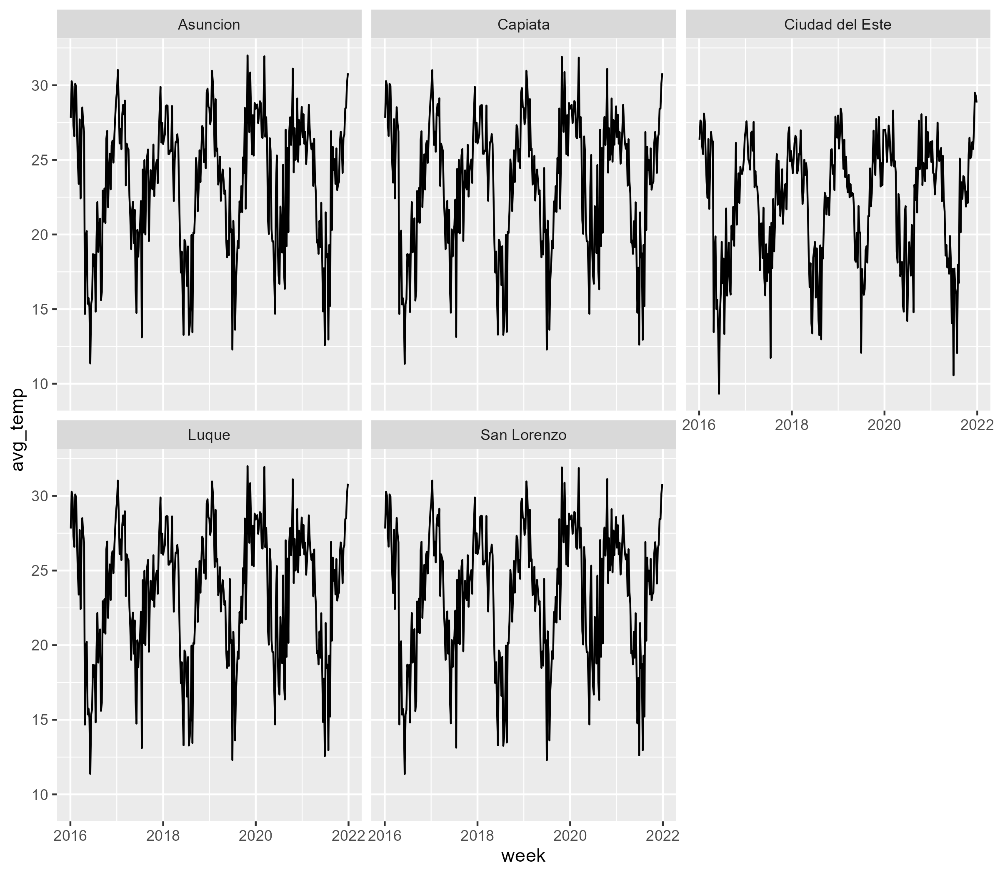

```{r setup, include = FALSE}
knitr::opts_chunk$set(
  collapse = TRUE,
  comment = "#>",
  fig.path = "man/figures/README-",
  out.width = "75%",
  warning = FALSE,
  message = FALSE,
  fig.retina = 2,
  fig.align = 'center'
)
library(tidyverse)
library(pRycollection)
library(frictionless)
```

Here are some more examples of how you can use the pRycollection package
or any of its dataset.
We stay with the `py_temperature` dataset, which has `r ncol(py_temperature)`
variables and `r nrow(py_temperature)` weeks of temperature data for the
cities of `r unique(py_temperature$city)`.
We could make, for example, a facet plot of the average weekly
temperature for each city in the dataset.

```r
plot
```

```{r plot, echo=FALSE, eval=FALSE}
plot <- py_temperature |> ggplot(aes(x = mdy(week), y = avg_temp)) +
  geom_line() +
  facet_wrap(~ city)
ggsave("../vignettes/fig/temp-plot.png", width = 8)
```

```{r, echo=FALSE}

```

